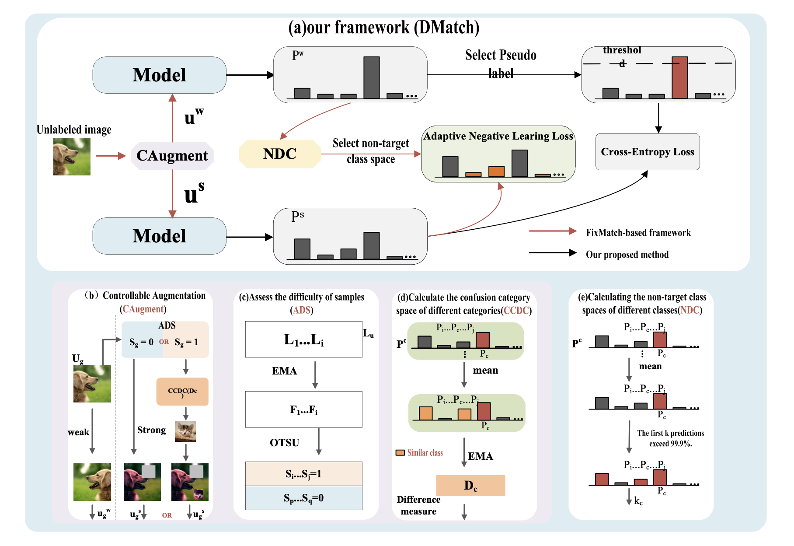

# DMatch
This repo is the official implementation for DMatch: Distinguish Confusing Classes with Unlabeled Data for Semi-Supervised Learning


## Architecture of DMatch     


# Prerequisites


- Python >= 3.6
- PyTorch >= 1.6.0
- torchvision >= 0.7.0
- matplotlib
- numpy
- pillow

- We provide the dependency file of our experimental environment, you can install all dependencies by creating a new anaconda virtual environment and running `pip install -r requirements.txt `


# Data Preparation

### Download datasets.

#### There are 3 datasets to download:

- CIFAR-10/100   
- SVHN    


### Data Processing

#### Directory Structure

Put downloaded data into the following directory structure:

```
- data/
  - cifar-10-batches-py/    # from 'cifar-10-python.tar.gz'
  - cifar-100-python/       # from 'cifar-100-python.tar.gz'
    ...
    ...
```

<!-- #### Generating Data

- Generate NTU RGB+D 60 or NTU RGB+D 120 dataset:

```
 cd ./data/ntu # or cd ./data/ntu120
 # Get skeleton of each performer
 python get_raw_skes_data.py
 # Remove the bad skeleton 
 python get_raw_denoised_data.py
 # Transform the skeleton to the center of the first frame
 python seq_transformation.py
``` -->

# Training & Testing

### Training

- Change the config file depending on what you want. Notably, please just use one GPU for training because we find that using mutiple GPUs would affect the performances.

```
# Example: Training DMatch with CIFAR-10 dataset on GPU0
python train.py --gpu-id 0 --dataset cifar10 --batch-size 64 --out results --seed 5
```
```
# Example: Training DMatch with CIFAR-100 dataset on GPU0
python train.py --gpu-id 0 --dataset cifar100 --batch-size 64 --out results --seed 5
```


### Testing

- To test the trained model and evaluate its effectiveness, run the following command:

```
python train.py --dataset cifar10 --batch-size 64 --seed 5
```
